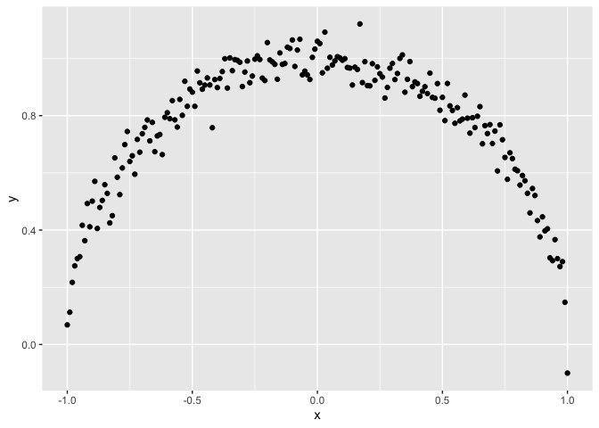

<!-- README.md is generated from README.Rmd. Please edit that file -->

# x2y

<!-- badges: start -->

<!-- badges: end -->

The goal of {x2y} is to provide column-to-column mutual information gain
for large dataframe, so that you can remove noise or redundant column
based on their information gain for a machine learning modeling.

This is a generalization of the fantastic [RViews blog post from Rama
Ramakrishnan](https://rviews.rstudio.com/2021/04/15/an-alternative-to-the-correlation-coefficient-that-works-for-numeric-and-categorical-variables/)

## Installation

You can install the development version of x2y from
[GitHub](https://github.com/) with:

``` r
# install.packages("pak")
pak::pak("cregouby/x2y")
```

## Example

This is a basic example which shows you how to solve a common problem:

``` r
library(x2y)
library(ggplot2)
## basic example code
set.seed(42)
x <- seq(-1,1,0.01)

circular_df <- data.frame(x = x,
                          y = sqrt(1 - x^2) + rnorm(length(x),mean = 0, sd = 0.05),
                          z = rnorm(length(x))
)

ggplot(circular_df, aes(x = x, y = y)) +
  geom_point() 
```



Here is the mutual information gain provided by {x2y} for this example

``` r
dx2y(circular_df)
#>   x y perc_of_obs   x2y
#> 1 x y         100 68.88
#> 2 z y         100 14.30
#> 3 y x         100 10.20
#> 4 y z         100  9.86
#> 5 z x         100  9.76
#> 6 x z         100  1.33
```

## Related work

- [{lares} package](https://laresbernardo.github.io/lares/) is having
  the `x2y()` function from the same inspiration.
